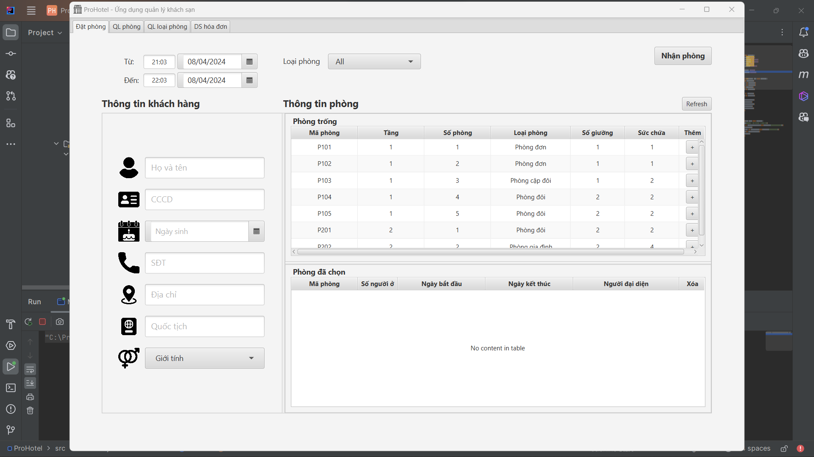

# Ứng dụng quản lý khách sạn `ProHotel`

## Mô tả
ProHotel là một chương trình quản lý khách sạn sử dụng ngôn ngữ lập trình Java và thư viện đồ họa JavaFX.  

Ứng dụng thể hiện các vị trí, các chức năng quản lý trong khuôn khổ một cơ sở khách sạn.  
Ví dụ:  
+ Hiển thị các phòng trống trong khoảng thời gian nhất định
+ Quản lý các hạng phòng, các phòng bao gồm giá cả cũng như tên gọi

## Authors

## Screenshots

Giao diện đăng nhập

Giao diện đặt phòng

Giao diện quản lý phòng

Hiển thị các thông tin cơ bản về tình trạng thuê hiện tại của phòng

Giao diện quản lý loại phòng

Giao diện hiển thị danh sách các hóa đơn

## Features
* Thêm, sửa, xóa loại phòng ở trong khách sạn
* Thêm sửa, xóa các phòng, tự động gen mã phòng dựa trên số tầng và số hiệu của phòng, phân vào loại phòng có sẵn
* Lọc danh sách phòng, hiển thị các phòng còn trống, lọc theo loại phòng
* Tự động kiểm tra số CCCD, nếu đã tồn tại thì tự động cập nhật các thông tin của khách hàng đó, nếu chưa có trong CSDL thì tự động thêm vào
* Một khách hàng có thể đặt nhiều phòng (phù hợp trong trường hợp đi du lịch theo tour, một người đứng ra đặt phòng cho những người còn lại)
* Xuất hóa đơn theo từng phòng

## Requirements
* Source format: JDK 17
* Profile: Full JRE
* Encoding: UTF-8
* Intellij IDE

## Video
https://www.youtube.com/watch?v=BSAwOavmu4E

## UML
<Đang cập nhật>

## Installation
* Clone repo này về local
* Cài đặt JDK, Intellij IDE
* Mở project trên Intellij và chạy hàm Main